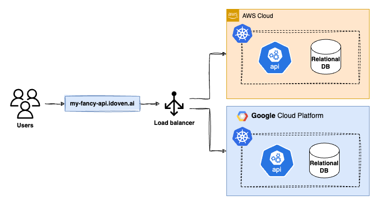
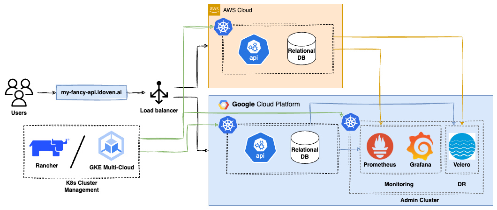

# **DEVOPS CHALLENGE: Solution proposal**

This repository aims to give a personal workaround for the devops challenge proposed here: [Devops challenge](https://github.com/idoven/devops-challenge)

The scenario shows an API service deployed on two different cloud providers (AWS and GPC) that relies on a relational database.
Both the API and database are hosted in Kubernetes.

The setup is currently in an active-passive configuration, meaning only one provider is operational at any given time.

---

## 1. **Which database would you choose?**
To satisfy the requirement for a relational database to be hosted in both Kubernetes cluster in AWS and GCP, there are some alternatives that come up to place after studying to current state of art regarding relational databases:
- PostgreSQL
- MariaDB
- CockroachDB

While MariaDB might offer a simpler setup in some cases and CockroachDB excels in distributed scenarios, PostgreSQL provides the best balance of features, performance, and flexibility for this scenario. Its robust replication capabilities, strong consistency model, and extensive ecosystem make it suits well for maintaining data integrity and performance.

For the active-passive scenario proposed, I would go with [PostgreSQL](https://www.postgresql.org) as the RDS to be deployed in both clusters, due to its robustness, scalability and compatibility with both AWS and GCP K8s environments.
- PostgreSQL can be run on Kubernetes using StatefulSets, which provide persistent storage for the data.
- It offers support for replication and failover mechanisms, which are critical for an active-passive configuration across AWS and GCP, to guarantee consistency between both clusters.
- Regarding performance, PostgreSQL has been proven to offer high performance and capacities for handling complex queries, making it suitable for API operations that require that kind of operations.
- PostgreSQL is strongly backed up with community support and several tools that complement it for management and monitoring tasks.

### Trades-offs identified
- Data synchronization: due to the requirements given, having a replica of the database would incur in inconsistency of the data if synchronization is not handled properly. Planification of replication strategies would be worth to be carefully handled.
- Latency: due to cross-cloud replication processes, the API service would suffer from latency issues when writing/reading against the database.
- Cost: running the database on both Kubernetes clusters may incur higher costs. If vendor lock-in was not an issue, it would be interesting to explore managed database services either in AWS or GCP.
- Backup and disaster recovery: since the database will be hosted in Kubernetes, a backup and DR plan must be implemented, which would require additional resources to be put in place.

---

## 2. How would you manage deployments?
### Cloud providers management
Regarding cloud providers resources, I would go with **[Terraform](https://www.terraform.io)** to define and manage infrastructure resources across both AWS and GCP. This would enable consistency and version control over infrastructure changes.
This approach would include:
- Network resources
- Kubernetes clusters infrastructure
- Firewall rules
- Interconnectivity resources between both AWS and GCP
- IAM resources, such as service accounts and definition of roles and permissions
- Artifact registries for Docker images
### Kubernetes management
Since we will have to manage two clusters in different cloud providers, we need a multi-cluster Kubernetes management tool to centralize control and visibility across them.
For being cloud-agnostic, I would recommend **[Rancher](https://www.rancher.com)** for this purpose, since this tool would help simplify cluster management and centralize it.
If vendor lock-in is not a concern, then I would  go for **[GKE Multi-Cloud](https://cloud.google.com/kubernetes-engine/multi-cloud/docs)**, since in this scenario we would be already using Google Kubernetes Engine in addition to Elastic Kubernetes Service in AWS. This would also serve the purpose of managing both clusters.
### CI/CD and version control
To enable CI/CD and version control over the API service, I would go with a single repository hosted in **[GitHub](https://github.com)**, in order to integrate it with **[GitHub Actions](https://github.com/features/actions)** as a mechanism to enable pipelines for continuous integration and delivery of the API.
I would include testing stages in the pipelines to ensure every change is properly tested before its deployment to the platform.
Since we are in a multi-cloud scenario, I would define a pipeline for each of the providers, both of them triggered by any change made in the code.
### Traffic routing and failover mechanism
I would recommend using a global HTTPS load balancer in GCP with a backend service that would point to the AWS and GCP based Kubernetes clusters. Then I would establish priorities to assign the active cluster and monitor the health checks from the cluster, so the load balancer can automatically take control and migrate the load from the active cluster to the passive in case of major failover.
This way we would have an automated mechanism to handle failovers and minimize downtime during the cluster transition

---

## 3. What approach would you take for backups?
For the backup, since AWS doesn’t have a dedicated backup product for Kubernetes and the idea is to reduce toil as much as possible to manage both AWS and GCP Kubernetes clusters, I would recommend a tool that could be deployed in both providers and managed the most likely as possible.
To fulfill this approach, I recommend Velero. It has compatibility both with AWS and GCP, being possible to use AWS S3 bucket and GCP Cloud storage buckets as backup platforms.

**[Velero](https://velero.io)** is a native Kubernetes solution for backups, since it allows the implementation of automated backups of the entire cluster state and application data. It can make use of cloud native snapshot capabilities for persistent volumes and the backups can be stored in the mentioned cloud services for later recovery.

### Trade-offs identified
- Frequency: high frequency backups provide better recovery point objective, but it consumes more resources and may lead to performance issues. On the other hand, low frequency can come with the risk of data loss but is less intensive in resource usage.
- Reach: full backups are safer but consume more time and storage resources. Incremental ones would be faster and more efficient, but may add complexity for restoration processes.
- Consistency: it would need to be established what is the most important, whether giving consistency at application level, ensuring data integrity and potentially leading to downtimes, or focusing more on being preventing crashes, reducing downtime, assuming risks with in-flight transactions

---

## 4. How would you implement monitoring?
I would split monitoring into two perspectives:
- Cloud providers
- Kubernetes services
For the cloud providers, I would use its own monitoring platforms to put in place alerts on networking and clusters issues, although it would also be interesting to have it centralized so both clusters can be monitored from a single control tool.

Regarding monitoring and observability inside kubernetes, I recommend to implement a complete suite for both logging and monitoring and have it centralized so both the API and the database can be monitored, using cloud-agnostic resources, as **[Prometheus](https://prometheus.io)**, **[Grafana](https://grafana.com)** and the **[Kubernetes dashboard](https://kubernetes.io/docs/tasks/access-application-cluster/web-ui-dashboard/)**.

### Trade-offs identified
- Full monitoring of both the active and the passive clusters can lead to an increase in the costs for the whole solution.
- A decision has to be made in order to establish whether to take a pull or push approach for the monitoring, depending on the importance for the control over data collection intervals or reduce the network overhead that would bring an intensive monitoring approach.

---

## 5. Identify any potential gray areas that could affect functionality and propose solutions
Some of the following have been introduced in previous sections, but still here I would like to point out some potential issues and solutions proposed.
### Data synchronization
The relational database in the passive environment may become out of sync with the active one, leading to data inconsistencies when failover occurs. To mitigate this risk:
- Use database replication tools, like PostgreSQL streaming replication
- Implement a system to propagate changes in near real-time
- Consider using cloud-native database services with cross region replication
### Network latency
The cross-cloud data replication can introduce latency and make costs go higher. Possible solutions to this situation are:
- Optimize the replication processes to minimize resource usage
- Using dedicated interconnects between both AWS and GCP providers, if costs inferred by this approach are less than the costs associated with network usage
### Kubernetes version and compatibility
Difference between Kubernetes versions supported by cloud providers:
- Establish common Kubernetes version that is supported in both cloud providers
- Avoid using provider specific features that may differ between platforms
- Implement abstraction features to ensure portability of the solution. This applies also for monitoring and observability

---

## 6. If we want to transition to an active-active scenario, what modifications would be necessary?
### Database
To implement an active-active solution for the database, we should:
- Use a multi-master replication setup and consider using a solution like PostgreSQL with bi-directional replication
- Go for a distributed SQL database solution like **[CockroachDB](https://www.cockroachlabs.com)**.
These changes in the database may lead to increased complexity in database management, and potential conflicts between databases.

### Load balancing
If a global HTTPS load balancer is already in place, no major changes would be required. Nevertheless, we should keep special attention for the health checks to ensure traffic is always routed properly between AWS and GCP healthy instances.

This may incur additional costs and increase complexity in network configuration.

### API Service Configuration
We would need to ensure the API is stateless to allow easy scaling of the service across both clusters. Also, it would be advisable to implement caching and queueing mechanisms to avoid duplicity and inconsistency on the data.

---

## Architecture diagram update
Here you can find an architecture diagram with the proposed updates based on the responses given throughout this challenge.

